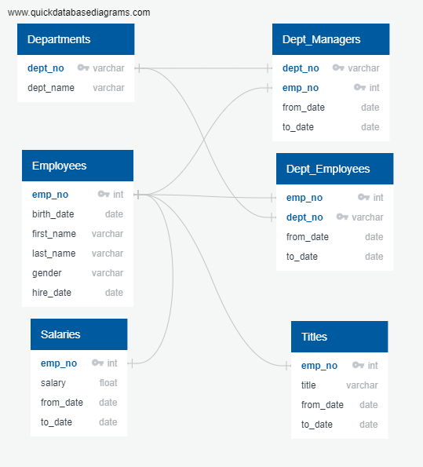
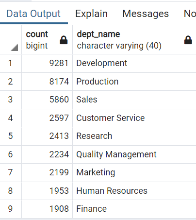
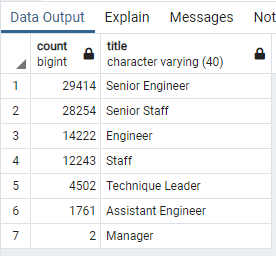
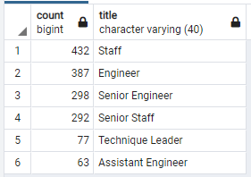
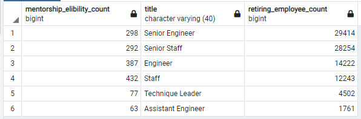

# Pewlett-Hackard_Analysis - Employee DataBase 

## Overview of Project
- Determine the number of retiring employees from Pewlett Hackard as per their title that eligible for the retirement package
- Identify employees who are eligible to participate in a mentorship program
- This analysis will help identify, decide and prepare for the "Silver Tsunami" (employees approaching retirement age)
- Using SQL too help work with putting together the employee database and run certain queries.

### Employee Database - Entity Relation Diagram


## Resources 
- VS Code v1.50.0 
- PgAdmin4 v 4.26
- PostgreSQL v12.4
-  (ERD)

## Results
#### Outcome from the analysis:
- A large and significant number of retirees grouped by titles are, Senior Engineer, Senior Staff, Engineer, Staff, Technical Leader, Assisstant Engineer and Manager
- Total employees in PH are 300,024
- The retirement package eligibility criteria (number of employees eligible) = 90,398 
- Mentorship eligibilty employees count upto 1549 only.

### Deparment retirees (Table 1)


###  Retirees by Job Title/Position (Table 2)


### Mentorship eligibiltiy grouped by department (Table 3)


## Summary 
### How many roles will need to be filled as the "Silver tsunami" begins to make an impact?
- In the coming years there are 90,398 employees retiring.
- This is a significant number as mentioned where the impact is concentrated with 4 job titles/positions that should be of concern to PH stakeholders.
- This can be seen in Table 2, as portrayed above.

### Are there enough qualified, retirement-ready employees in the departments to mentor the next generation of Pewlett Hackard employees?
- Table 3 shows the number of employees qualified by title and ready for mentorship totals up to 1549.
- Which when compared to the number of retirement ready employees is not sufficient to continue smooth operations and training sessions at PH. 
- A suggestion to increase the eligibility criteria for employees currently in PH to be mentored or cross training within the company (rearrange eligible mentors to cover the voids)

```
-- grouping by title for mentorship eligibility
SELECT COUNT(me.emp_no) AS mentorship_elibility_count, me.title
	INTO mentorship_by_dept
	FROM mentorship_eligibility AS me
	GROUP BY me.title
	ORDER BY COUNT(me.emp_no) DESC;

-- grouping by title for retirement employees
SELECT COUNT(ut.emp_no), ut.title
	INTO retiring_titles_count
	FROM unique_titles AS ut
	GROUP BY ut.title
	ORDER BY COUNT(ut.emp_no) DESC;

-- portraying both tables for comparison
SELECT m.mentorship_elibility_count, m.title, rc.count AS retiring_employee_count
	INTO cross_training
	FROM mentorship_by_dept AS m
	LEFT JOIN retiring_titles_count AS rc 
	ON (m.title = rc.title)
	ORDER BY rc.count DESC;
```
### Comparision of counts between mentorships eligible Vs retiring employee

